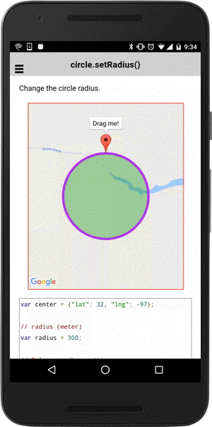

# circle.setRadius()

Change the circle radius.

```html
<div id="map_canvas"></div>
```

```js
var center = {"lat": 32, "lng": -97};

// radius (meter)
var radius = 300;

// Calculate the positions
var deg0 = plugin.google.maps.geometry.spherical.computeOffset(center, radius, 0);
var deg90 = plugin.google.maps.geometry.spherical.computeOffset(center, radius, 90);
var deg180 = plugin.google.maps.geometry.spherical.computeOffset(center, radius, 180);
var deg270 = plugin.google.maps.geometry.spherical.computeOffset(center, radius, 270);

var mapDiv = document.getElementById("map_canvas");
var map = plugin.google.maps.Map.getMap(mapDiv, {
  camera: {
    target: [
      center,
      deg0,
      deg90,
      deg180,
      deg270
    ],
    padding: 100
  }
});

map.addEventListener(plugin.google.maps.event.MAP_READY, function() {

  map.addMarker({
      'position': deg0,
      'draggable': true,
      'title': 'Drag me!'
  }, function(marker) {

    marker.showInfoWindow();

    // Add circle
    map.addCircle({
        'center': center,
        'radius': radius,
        'strokeColor' : '#AA00FF',
        'strokeWidth': 5,
        'fillColor' : '#00880055'
    }, function(circle) {

        marker.on("position_changed", function(oldValue, newValue) {
            // Calcurate distance between center and the marker position
            var radius = plugin.google.maps.geometry.spherical.computeDistanceBetween(center, newValue);

            // Update the redius
            circle.setRadius(radius);
        });

    });

  });

});
```


