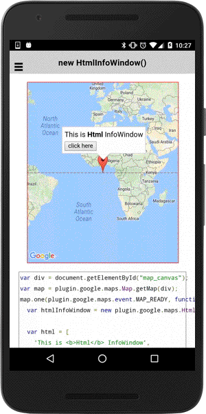

# new plugin.google.maps.HtmlInfoWindow()

You can display HTML elements in InfoWindow.

## memo

If you want to execute inline javascript (such as onclick), you need to define the following meta tag in HTML.

```html
<!DOCTYPE html>
<html>
  <head>
    ...
    <meta http-equiv="Content-Security-Policy" content="default-src 'self' gap:; script-src 'self' 'unsafe-inline' 'unsafe-eval' data: 'unsafe-eval'; object-src *; style-src 'self' data: 'unsafe-inline' *; img-src 'self' data: *; media-src 'self' data:; font-src 'self' data:; connect-src *">
    ...
  </head>
  <body>
    ...
    <div id="map_canvas"></div>
  </body>
</html>
```

```js
var div = document.getElementById("map_canvas");
var map = plugin.google.maps.Map.getMap(div);
map.one(plugin.google.maps.event.MAP_READY, function() {
  var htmlInfoWindow = new plugin.google.maps.HtmlInfoWindow();

  var html = [
    'This is &lt;b&gt;Html&lt;/b&gt; InfoWindow',
    '&lt;br&gt;',
    '&lt;button onclick="javascript:alert(\'clicked!\');"&gt;click here&lt;/button&gt;',
  ].join("");
  htmlInfoWindow.setContent(html);

  map.addMarker({
    position: {lat: 0, lng: 0},
    draggable: true
  }, function(marker) {

    marker.on(plugin.google.maps.event.MARKER_CLICK, function() {
      htmlInfoWindow.open(marker);
    });
    marker.trigger(plugin.google.maps.event.MARKER_CLICK);

  });
});
```


