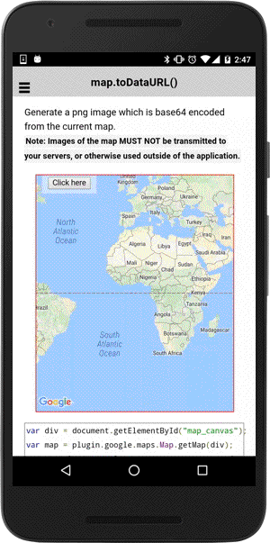

# map.toDataURL()

Generate a png image which is base64 encoded from the current map.

*Note: Images of the map **MUST NOT** be transmitted to your servers, or otherwise used outside of the application.*

```html
<div class="map" id="map_canvas">
    <span class="smallPanel"><button>Click here</button></span>
</div>
```

```js
var div = document.getElementById("map_canvas");
var map = plugin.google.maps.Map.getMap(div);
map.one(plugin.google.maps.event.MAP_READY, function() {

  var visible = true;
  var button = div.getElementsByTagName('button')[0];
  button.addEventListener('click', function() {

    // Create a snap shot
    map.toDataURL(function(imageData) {

      // Show the image.
      showImage(imageData);

    });
  });

});
function showImage(url) {
  // Show the image
  var bgDiv = document.createElement("div");
  bgDiv.style.position = "fixed";
  bgDiv.style.zIndex = 3;
  bgDiv.style.left = 0;
  bgDiv.style.top = 0;
  bgDiv.style.bottom = 0;
  bgDiv.style.right = 0;
  bgDiv.style.backgroundColor = "rgba(0,0,0,0.5)";

  var img = document.createElement("img");
  img.src = url;
  img.style.width = "75%";
  img.style.height = "auto";
  img.style.top = 0;
  img.style.left = 0;
  img.style.right = 0;
  img.style.bottom = 0;
  img.style.margin = "auto";
  img.style.position = "absolute";
  bgDiv.appendChild(img);

  bgDiv.addEventListener("click", function() {
    document.body.removeChild(bgDiv);
    bgDiv = null;
    img = null;
    bgDiv.removeEventListener("click", arguments.callee);
  });

  document.body.appendChild(bgDiv);

}
```


