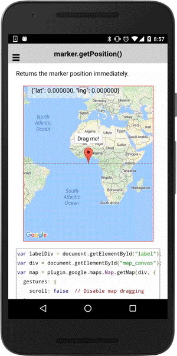

# marker.getPosition()

Get the marker position.

```html
<div class="map" id="map_canvas">
    <span class="smallPanel" id="label"></span>
</div>
```

```js
var labelDiv = document.getElementById("label");
var div = document.getElementById("map_canvas");
var map = plugin.google.maps.Map.getMap(div, {
  gestures: {
    scroll: false  // Disable map dragging
  }
});
map.one(plugin.google.maps.event.MAP_READY, function() {


  // Add a marker which is draggable.
  map.addMarker({
    position: {
      lat: 0,
      lng: 0
    },
    draggable: true,
    title: "Drag me!"
  }, function(marker) {

    // Open the info window.
    marker.showInfoWindow();

    // Display the current location
    labelDiv.innerText = marker.getPosition().toUrlValue();

    // Catch the drag events.
    marker.on(plugin.google.maps.event.MARKER_DRAG_START, onMarkerDrag);
    marker.on(plugin.google.maps.event.MARKER_DRAG, onMarkerDrag);
    marker.on(plugin.google.maps.event.MARKER_DRAG_END, onMarkerDrag);
  });

});

function onMarkerDrag() {
  var marker = this;

  // Display the current location
  labelDiv.innerText = marker.getPosition().toUrlValue();
}
```


