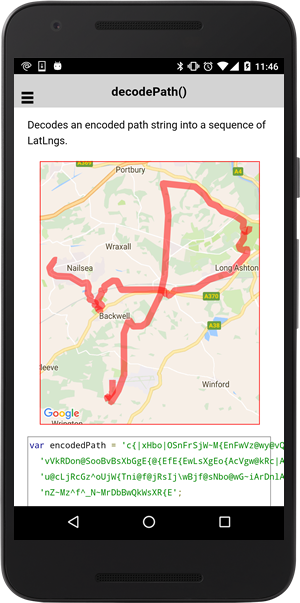

# encoding.decodePath()

Decodes an encoded path string into a sequence of LatLngs.

```js
<div id="map_canvas"></div>
```

```js
var encodedPath = 'c{|xHbo|OSnFrSjW~M{EnFwVz@wy@vQsq@cBoUzJ{EzObBrIcLfE~C~H{Y~C~CfOgY{EjM{EgTcLzTsSwQcGf@IoKgJSkMsb@RkR' +
  'vVkRDon@SooBvBsXbGgE{@{EfE{EwLsXgEo{AcVgw@kRc|A_q@seAcLg@bBvQkCnKcGjCwQsSkM?cL{YjHrS{J~HgOwBgOjf@{Jj' +
  'u@cLjRcGz^oUjW{Tni@f@jRsIj\wBjf@sNbo@wG~iArDnlArIj\bGfr@bQf^~WrSnPvVfOjHnURzc@cQbQzc@nUrtAbBfYkC~M~H' +
  'nZ~Mz^f^_N~MrDbBwQkWsXR{E';

var points = plugin.google.maps.geometry.encoding.decodePath(encodedPath);

var mapDiv = document.getElementById("map_canvas");
var map = plugin.google.maps.Map.getMap(mapDiv, {
  camera: {
    target: points
  }
});

map.addEventListener(plugin.google.maps.event.MAP_READY, function() {

  map.addPolyline({
    "points": points
  });

});
```


