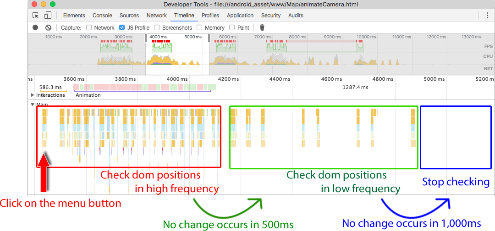
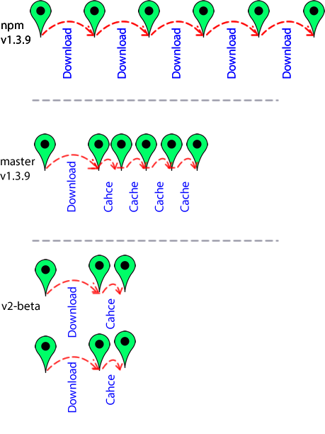

# What's new the cordova-google-maps-plugin version 2?

The plugin version 2 has been improved from the plugin v1 a lot.

### change 1 . multiple maps

As you may know, the next version supports multiple map in the same html.
However one map takes large memory, so I recommend 2,3 maps at the one page.
If you don't use a map, remove it. That's save the memory.

### change 2. multiple pages

Version 1.x supports only single html file (typically index.html)
The next version supports multiple HTML file (such as index.html, page1.html, page2.html ...etc)
You don't need to cleanup the maps if you change html files.
The plugin will do automatically.

However, changing tab page in the same html is a different.
You need to still do `map.setVisible(true/false)` by yourself.

### change 3. Recognize all html element

Version 1.x supports only under the map div.
The next version recognize all HTML element of the page.
It means you don't need to execute `map.setClickable(true/false)` when HTML dialog is popped up on the map div.

**Here is the tips**
If the plugin does not recognize your HTML elements on the map div, specify css
```css
.dialog {
    position: fixed;
    z-index: 1000; //any value is fine
}
```

Since the html elements that have `position:fixed` takes a priority always in the maps plugin.
(You don't need to do this usually (I believe so))

### change 4. save battery life

The problem of the version 1.x is the [KeepWatching Timer](https://github.com/mapsplugin/cordova-plugin-googlemaps/tree/caf6ec1099afc0c2993a367a346d44b6e5b0f99c/www/googlemaps-cdv-plugin.js#L2474).
This timer watches HTML element positions under the map div periodically.
However, if you don't do anything on your app, still the timer is running.
This is affect for battery life.

In the next version, the timer stops automatically if the user does not touch on the map anything for a while.
If the user touch on the app again, the timer also starts.
If no changes for a while, stop the timer again.



If you need to start the timer programmatically, you can do like this:
```js
cordova.fireDocumentEvent('plugin_touch', {});

or

var event = document.createEvent('plugin_touch');
event.initEvent(eventName, false, false);
document.dispatchEvent(event);
```

**NOTE: The plugin v2 now uses `plugin_touch` instead of `touch_start`**

### change 5. performance improved

Another big problem of the version 1.x is that all (most) native code run on the UI thread (or run on the WebCore thread.
The reason of this is the Google Maps native APIs require do it.
However I tested so much time and rewrite all most whole code in both native and javascript, the most code run on the background thread.

And the most of all code run in parallel.
For example, adding multiple marker on a map works like this.



In the end, adding multiple marker become so faster.

<table>
<tr>
<td><a href="https://github.com/mapsplugin/cordova-plugin-googlemaps/tree/1.3.9">npm version1.3.9</a></td>
<td><a href="https://github.com/mapsplugin/cordova-plugin-googlemaps/tree/caf6ec1099afc0c2993a367a346d44b6e5b0f99c">v1.3.9 Master branch / commit caf6ec1099</a></td>
<td><a href="https://github.com/mapsplugin/cordova-plugin-googlemaps/commit/906fc049d62b3f1cc8b6bab0dbcff5b1113b907d">v2-beta / commit 906fc04</a></td>
</tr>

<tr>
<td><br><b>47.1 sec</b></td>
<td><br><b>1.0 sec</b></td>
<td><br><b>0.5 sec</b>
</td>
</tr>
</table>

See more information at [issue #835: Performance problems when adding many markers](https://github.com/mapsplugin/cordova-plugin-googlemaps/issues/835#issuecomment-251778071)

If you don't understand this talk , you can skip this. Just remember the performance is improved.

### change 6. split the JS file

The version 1.x code of the Javascript is [googlemaps-cdv-plugin.js](https://github.com/mapsplugin/cordova-plugin-googlemaps/tree/caf6ec1099afc0c2993a367a346d44b6e5b0f99c/www/googlemaps-cdv-plugin.js)
The file includes 2873 lines. Wow, it's too large. Not suite for maintenance...even for me.

I split the JS files for each classes (such as Marker.js, Circle.js, etc)
https://github.com/mapsplugin/cordova-plugin-googlemaps/tree/multiple_maps/www

You can debug easily :)

### change 7. introduce BaseArrayClass

If you are familiar with the Google Maps Javascritp API v3, you probably know the [MVCArray class](https://developers.google.com/maps/documentation/javascript/3.exp/reference#MVCArray)
The benefit of this class is you can monitor the events: `insert_at`, `set_at`, and `remove_at`.
Using this class, your code would be simple.

### change 8. property synchronizing

This is really useful. Most of `getXXXX()` methods return the values as normal javascript object.

For example, in version 1.x,
```js
marker.getPosition(function(position) {
   // you have to wait the callback
});
```

in version 2.0-beta
```js
var position = marker.getPosition();
```

You know what? Since the marker (and polyline,polygon...etc) extends the BaseClass (which is MVC class), you can monitor like this.

```js
markers[0].on("position_changed", onPositionChanged);
markers[1].on("position_changed", onPositionChanged);
markers[2].on("position_changed", onPositionChanged);

function onPositionChanged() {
  var marker = this;
  var position = marker.getPosition();
}
```

However, `map.getVisibleRegion()` does not support this way.
you still have to use callbak.

### change 9. chain programming

In version 2.0, most of all `setXXX()` methods are able to chain.

```js
marker.setPosition({"lat": ...., "lng": ....}).setTitle("Hello");
```

### change 10. add more events, and renamed

#### Version 1.x events
<table>
<tr><th>event name</th>
<th>Androide</th>
<th>iOS</th>
</tr>
<tr><td> MAP_CLICK </td><td> YES </td><td> YES </td></tr>
<tr><td> MAP_LONG_CLICK </td><td> YES </td><td> YES </td></tr>
<tr><td> MY_LOCATION_CHANGE </td><td> YES </td><td> NO </td></tr>
<tr><td> MY_LOCATION_BUTTON_CLICK </td><td> YES </td><td> YES </td></tr>
<tr><td> INDOOR_BUILDING_FOCUSED </td><td> YES </td><td> YES </td></tr>
<tr><td> INDOOR_LEVEL_ACTIVATED </td><td> YES </td><td> YES </td></tr>
<tr><td> CAMERA_CHANGE </td><td> YES </td><td> YES </td></tr>
<tr><td> CAMERA_IDLE </td><td> NO </td><td> YES </td></tr>
<tr><td> MAP_READY </td><td> YES </td><td> YES </td></tr>
<tr><td> MAP_LOADED </td><td> YES </td><td> NO </td></tr>
<tr><td> MAP_WILL_MOVE </td><td> NO </td><td> YES </td></tr>
<tr><td> MAP_CLOSE </td><td> YES </td><td> YES </td></tr>
<tr><td> OVERLAY_CLICK </td><td> YES </td><td> YES </td></tr>
<tr><td> INFO_CLICK </td><td> YES </td><td> YES </td></tr>
<tr><td> MARKER_DRAG </td><td> YES </td><td> YES </td></tr>
<tr><td> MARKER_DRAG_START </td><td> YES </td><td> YES </td></tr>
<tr><td> MARKER_DRAG_END </td><td> YES </td><td> YES </td></tr>
</table>

#### Version 2.x events
<table>
<tr><th>event name</th>
<th>Androide</th>
<th>iOS</th>
<th>arguments[0]</th>
</tr>
<tr><td> MAP_READY </td><td> YES </td><td> YES </td><td> none </td></tr>
<tr><td> MAP_CLICK </td><td> YES </td><td> YES </td><td>  LatLng </td></tr>
<tr><td> MAP_LONG_CLICK </td><td> YES </td><td> YES </td><td>  LatLng </td></tr>
<tr><td> MY_LOCATION_BUTTON_CLICK </td><td> YES </td><td> YES </td><td> none </td></tr>
<tr><td> INDOOR_BUILDING_FOCUSED </td><td> YES </td><td> YES </td><td> none </td></tr>
<tr><td> INDOOR_LEVEL_ACTIVATED </td><td> YES </td><td> YES </td><td>  building information </td></tr>
<tr><td> CAMERA_MOVE_START </td><td> YES </td><td> YES </td><td> true if the camera move start by gesture </td></tr>
<tr><td> CAMERA_MOVE </td><td> YES </td><td> YES </td><td>  CameraPosition </td></tr>
<tr><td> CAMERA_MOVE_END </td><td> YES </td><td> YES </td><td>  CameraPosition </td></tr>
<tr><td> POLYGON_CLICK </td><td> YES </td><td> YES </td><td> LatLng(clicked position) </td></tr>
<tr><td> POLYLINE_CLICK </td><td> YES </td><td> YES </td><td> LatLng(clicked position) </td></tr>
<tr><td> CIRCLE_CLICK </td><td> YES </td><td> YES </td><td> LatLng(clicked position) </td></tr>
<tr><td> GROUND_OVERLAY_CLICK </td><td> YES </td><td> YES </td><td> LatLng(clicked position) </td></tr>
<tr><td> INFO_CLICK </td><td> YES </td><td> YES </td><td> LatLng(marker position) </td></tr>
<tr><td> INFO_LONG_CLICK </td><td> YES </td><td> YES </td><td> LatLng(marker position) </td></tr>
<tr><td> INFO_CLOSE </td><td> YES </td><td> YES </td><td> LatLng(marker position) </td></tr>
<tr><td> INFO_OPEN </td><td> YES </td><td> YES </td><td> LatLng(marker position) </td></tr>
<tr><td> MARKER_CLICK </td><td> YES </td><td> YES </td><td> LatLng(marker position) </td></tr>
<tr><td> MARKER_DRAG </td><td> YES </td><td> YES </td><td> LatLng(marker position) </td></tr>
<tr><td> MARKER_DRAG_START </td><td> YES </td><td> YES </td><td> LatLng(marker position) </td></tr>
<tr><td> MARKER_DRAG_END </td><td> YES </td><td> YES </td><td> LatLng(marker position) </td></tr>
</table>

### change 11. set background color

use `plugin.google.maps.environment.setBackgroundColor()`

### change 12. geocoding/reverse geocoding

You can do like this

```js
plugin.google.maps.Geocoder.geocode({
  "address" : [
     "address1", "address2" ... "addressN"
  ]
}, function( mvcArray ) {

  mvcArray.on('insert_at', function(index) {
     console.log( mvcArray.getAt(index) );
  });

});
```

### change 13. add some features

I forgot to much. See the demo apk.

### change 14. Not yet

`map.showDialog()`, `map.closeDialog()`, and `map.addKmlOverlay()` are not ready yet.


### change 15. UIWebView & WKWebView

Both are Supported.

Crosswalk is not confirmed yet.

I think I miss something. I will post them if I remember.
